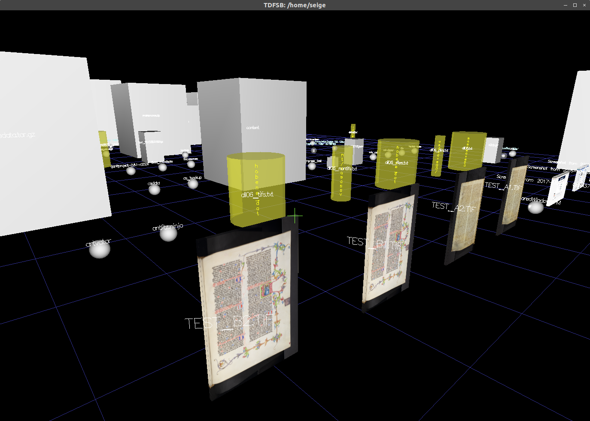

# TDFSB
... is a '3D - Filesystem Browser' for GNU/Linux, it was once my post popular Open Source project for many years. Current version is still 0.0.10 (seems to be stable). This version should also runs on BeOS and FreeBSD! ([old Homepage](http://determinate.net/webdata/seg/tdfsb.html))

TDFSB is quite old, so better try [3dfsb](https://github.com/3dfsb-dev/3dfsb) instead. However, this version here compiles and runs for instance on Ubuntu 18.04.2 LTS. Click the image for an old demo video on Youtube.

## TDFSB in the News

* TDFSB was in the [Linux Journal, 2001](https://www.linuxjournal.com/article/5504)
* TDFSB on [UnrealBlog](http://unrealstuff.bplaced.de/index.php?id=147)
* TDFSB in [Linux User Magazine, 2017](https://www.linux-user.de/ausgabe/2007/02/042-3dbrowser/index.html)
* TDFSB on [Silly Bytes, 2017](https://sillybytes.net/2012/04/navegando-en-3d-en-nuestros-directorios.html)
* TDFSB o [Linux Toy,2018](https://linuxtoy.org/archives/tdfsb.html)
